---

## 🍪 Cookie-Based Authentication Flow

This service implements a **secure JWT authentication system** using `HttpOnly` cookies to manage user sessions between the React frontend (`localhost:5173`) and the Django Auth Service (`localhost:9090`).

---

### 🧭 **Flow Overview**

```mermaid
sequenceDiagram
    participant User as 👤 User (Browser)
    participant React as 🧩 React Frontend
    participant Django as 🐍 Django Auth Service

    User->>React: Submits login form (email + password)
    React->>Django: POST /api/token/
    Django-->>React: Set-Cookie: access_token, refresh_token (HttpOnly)
    React->>Django: GET /api/token/validate/ (with cookies)
    Django-->>React: 200 OK (User validated)
    React->>Django: Uses access_token until expiry
    Django-->>React: 401 (Token expired)
    React->>Django: Automatically refreshes via /api/token/refresh/
    Django-->>React: New access_token (Set-Cookie)
```



---

### 🔐 **Token Types**

| Token           | Purpose                          | Lifetime | Storage | HttpOnly |
| --------------- | -------------------------------- | -------- | ------- | -------- |
| `access_token`  | Authenticates user for API calls | 3 hours  | Cookie  | ✅        |
| `refresh_token` | Issues new access tokens         | 7 days   | Cookie  | ✅        |

---

### ⚙️ **CORS Configuration**

| Setting                            | Value                                              |
| ---------------------------------- | -------------------------------------------------- |
| `Access-Control-Allow-Origin`      | `http://localhost:5173`                            |
| `Access-Control-Allow-Credentials` | `true`                                             |
| `Access-Control-Allow-Headers`     | `accept, authorization, content-type, x-csrftoken` |
| `Access-Control-Allow-Methods`     | `GET, POST, PUT, PATCH, DELETE, OPTIONS`           |

**Frontend Requests Must Include:**

```js
fetch("http://localhost:9090/api/token/validate/", {
  method: "GET",
  credentials: "include", // Enables cookie authentication
});
```

---

### 🧪 **Authentication Test Results**

| Test          | Description                              | Result                    |
| ------------- | ---------------------------------------- | ------------------------- |
| 🧩 **Test 1** | Check `/api/test-cookies/` without token | ❌ 401 — Invalid token     |
| 🔑 **Test 2** | Login and receive cookies                | ✅ `Set-Cookie` headers OK |
| 🧾 **Test 3** | Validate token using cookies             | ✅ 200 — Valid token       |
| 🌐 **Test 4** | CORS Preflight check                     | ✅ 200 — Origin allowed    |

---

### 🧰 **Security Best Practices**

* `HttpOnly` cookies protect against XSS
* `SameSite=Lax` mitigates CSRF
* Tokens are short-lived and auto-refreshed
* JWTs are never stored in `localStorage` or `sessionStorage`

---

## 🧾 PowerShell Test Script

The following PowerShell script performs **end-to-end tests** on your Django Auth Service:

* ✅ Tests cookie headers
* ✅ Logs in and checks tokens
* ✅ Validates token using cookies
* ✅ Performs a CORS preflight test

> 💡 Run this from your **Windows PowerShell terminal** (inside your backend directory).

```powershell
# Test 1: Check if Set-Cookie headers are being sent
Write-Host "`n=== TEST 1: Testing Set-Cookie Headers ===" -ForegroundColor Cyan

$response = Invoke-WebRequest -Uri "http://localhost:9090/api/test-cookies/" `
  -Method POST `
  -Headers @{"Content-Type"="application/json"} `
  -Body '{"key":"value"}' `
  -SessionVariable session

Write-Host "`nResponse Status: $($response.StatusCode)" -ForegroundColor Green
Write-Host "`nSet-Cookie Headers:" -ForegroundColor Yellow
$response.Headers['Set-Cookie'] | ForEach-Object { Write-Host "  $_" }

Write-Host "`nCookies in Session:" -ForegroundColor Yellow
$session.Cookies.GetCookies("http://localhost:9090") | ForEach-Object {
  Write-Host "  Name: $($_.Name), Value: $($_.Value), Secure: $($_.Secure), HttpOnly: $($_.HttpOnly)"
}

# Test 2: Try to login and capture cookies
Write-Host "`n`n=== TEST 2: Testing Login with Cookies ===" -ForegroundColor Cyan

$loginBody = @{
  email = "support@prolianceltd.com"  # Replace with actual test email
  password = "qwerty"  # Replace with actual password
} | ConvertTo-Json

try {
  $loginResponse = Invoke-WebRequest -Uri "http://localhost:9090/api/token/" `
    -Method POST `
    -Headers @{"Content-Type"="application/json"} `
    -Body $loginBody `
    -SessionVariable loginSession

  Write-Host "`nLogin Status: $($loginResponse.StatusCode)" -ForegroundColor Green
  
  Write-Host "`nSet-Cookie Headers from Login:" -ForegroundColor Yellow
  $loginResponse.Headers['Set-Cookie'] | ForEach-Object { Write-Host "  $_" }

  Write-Host "`nCookies Stored After Login:" -ForegroundColor Yellow
  $loginSession.Cookies.GetCookies("http://localhost:9090") | ForEach-Object {
    Write-Host "  Name: $($_.Name)"
    Write-Host "    Value: $($_.Value.Substring(0, [Math]::Min(50, $_.Value.Length)))..."
    Write-Host "    Secure: $($_.Secure)"
    Write-Host "    HttpOnly: $($_.HttpOnly)"
    Write-Host "    Domain: $($_.Domain)"
    Write-Host "    Path: $($_.Path)"
  }

  # Test 3: Use cookies to validate token
  Write-Host "`n`n=== TEST 3: Testing Token Validation with Cookies ===" -ForegroundColor Cyan

  $validateResponse = Invoke-WebRequest -Uri "http://localhost:9090/api/token/validate/" `
    -Method GET `
    -WebSession $loginSession

  Write-Host "`nValidation Status: $($validateResponse.StatusCode)" -ForegroundColor Green
  Write-Host "`nValidation Response:" -ForegroundColor Yellow
  Write-Host $validateResponse.Content

} catch {
  Write-Host "`nError during login test:" -ForegroundColor Red
  Write-Host $_.Exception.Message
  if ($_.Exception.Response) {
    $reader = New-Object System.IO.StreamReader($_.Exception.Response.GetResponseStream())
    $reader.BaseStream.Position = 0
    $responseBody = $reader.ReadToEnd()
    Write-Host "Response Body: $responseBody" -ForegroundColor Red
  }
}

# Test 4: Check CORS preflight
Write-Host "`n`n=== TEST 4: CORS Preflight Check ===" -ForegroundColor Cyan

$corsResponse = Invoke-WebRequest -Uri "http://localhost:9090/api/token/" `
  -Method OPTIONS `
  -Headers @{
    "Origin" = "http://localhost:5173"
    "Access-Control-Request-Method" = "POST"
    "Access-Control-Request-Headers" = "content-type"
  }

Write-Host "`nCORS Status: $($corsResponse.StatusCode)" -ForegroundColor Green
Write-Host "`nCORS Headers:" -ForegroundColor Yellow
$corsResponse.Headers.GetEnumerator() | Where-Object { $_.Key -like "*access-control*" } | ForEach-Object {
  Write-Host "  $($_.Key): $($_.Value)"
}

Write-Host "`n`n=== All Tests Complete ===" -ForegroundColor Cyan
```

---

